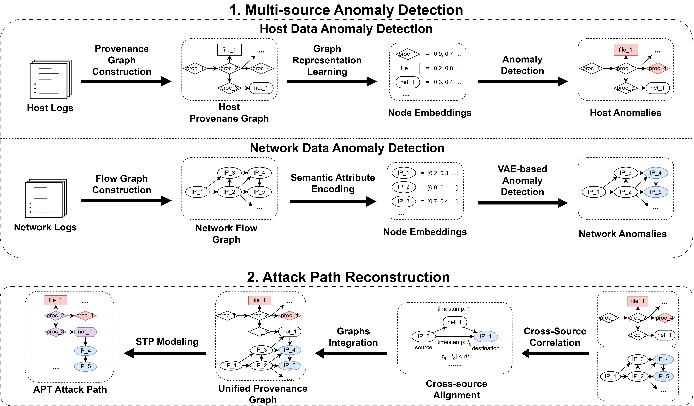

# CROSSHOUND

This is the code for the paper "CROSSHOUND: Multi-Source Provenance Correlation for AdvancedPersistent Threat Detection and Investigation". 



This paper presents CROSSHOUND, the first open-source, provenance-based system that performs fine-grained APT detection by correlating anomalies from both host and network logs. Unlike prior approaches, CROSSHOUND employs a decoupled anomaly detection strategy, independently analyzing host and network provenance graphs while preserving their semantic relationships. It introduces a cross-source correlation technique that bridges host and network anomalies using IP five-tuples and temporal proximity, enabling precise linkage of malicious events. Additionally, CROSSHOUND formulates attack path reconstruction as a Steiner Tree Problem (STP), efficiently connecting multi-source anomalies while minimizing false positives.

## Installation
* Python 3.8+
* Option 1: Pip
    ```bash
    pip install -r requirements.txt
    pip install torch==2.1.0 torchvision==0.16.0 torchaudio==2.1.0 --index-url https://download.pytorch.org/whl/cu121
    pip install  dgl -f https://data.dgl.ai/wheels/torch-2.1/cu121/repo.html
    ```
* Option 2: Conda
    ```bash
    conda env create -f environment.yml  
    conda activate [env_name]  
    ```

## Structure

* `preprocess/`: Preprocess OpTC dataset
* `host-detect/`: host data anomaly detection
* `net-detect/`: network data anomaly detection
* `investigate/`: STP-based attack path reconstruction

## Usage

### Quick Demo
According to `investigate/README.md`, perform multi-source provenance correlation to reconstruct the attack paths. 

### Training from Scratch

1. Run `preprocess/OpTC_preprocess.ipynb` to download and preprocess dataset. 
2. According to `host-detect/README.md`, train the host data detector and obtain host anomalies. 
3. According to `net-detect/README.md`, train the network data detector and obtain network anomalies. 
4. According to `investigate/README.md`, perform multi-source provenance correlation to reconstruct the attack paths. 